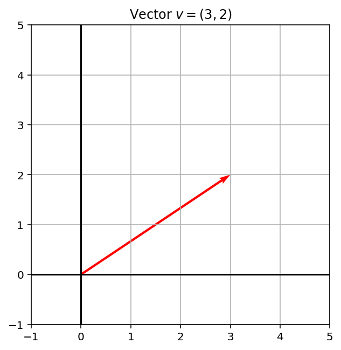
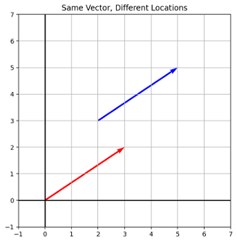
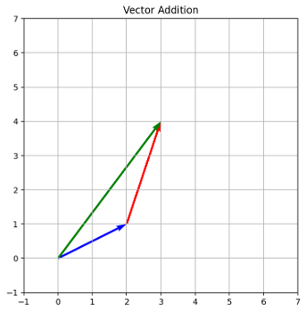
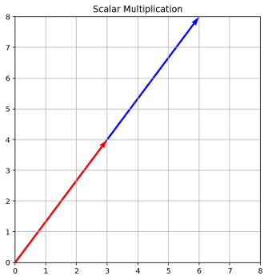
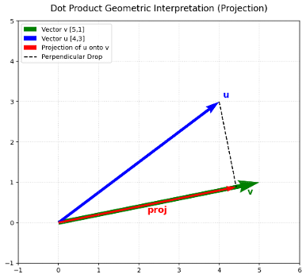
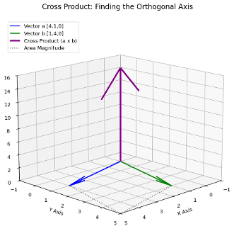
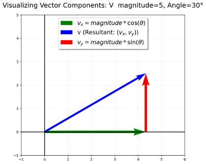

## 

## Lists and Vectors

- Standard Python is designed for general software development, not math.
- Structures like lists in Python have their own set of rules that makes using them in mathematical operations difficult.
- If we try to perform math on a standard Python list, the results are either completely wrong for our purposes, or they crash the program.

## Lists and Vectors

Consider a list of test scores: `scores = [85, 90, 78]`

If we want to double the score of every student, our first instinct is to multiply the list by 2:

- `print(scores * 2)`

But what happens is it repeats the list items

```{python}
scores = [85, 90,  78]
print(scores * 2)
```

Now, if we try to add 2 bonus points to every score using `scores + 2`, Python throws a **TypeError** because it does not understand how to combine a list with an integer.

## Libraries

- If we want mathematics to play well with the idea of lists, we need more specialized tools.
- Libraries are **external** toolsets built that we can bring into our Python code.
- For numerical data, the industry standard is **NumPy** (Numerical Python).
- If you are working on a local machine, you likely need to install the library first using **pip install numpy** in your terminal.
- Cloud environments like Colab usually have it pre-installed.

## Standard Library Functions and the import Statement 

- **Standard library:** library of pre-written functions that comes with Python

  - **Library functions** perform tasks that programmers commonly need

    - Example: print, input, range
    - Viewed by programmers as a “black box”

- Some library functions built into Python interpreter

  - To use, just call the function

- **Modules:** files that stores functions of the standard library

  - Help organize library functions not built into the interpreter
  - Copied to computer when you install Python

- To call a function stored in a module, need to write an import statement

  - Written at the top of the program
  - Format: import *module_name*

## Importing NumPy

- Once you have access to NumPy we need to use an import statement:

```{python}
import numpy as np
```

- We use `as np` as a standard convention.
- It acts as a nickname so we do not have to type "numpy" every time we want to use one of its tools.

## Creating Arrays

- To use NumPy's features, we must convert our standard Python list into a specialized NumPy object called a **ndarray** (n-dimensional array).

```{python}
scores = [85, 90, 78]

np_scores = np.array(scores)
```

- Our data is now stored in a format designed for mathematics.

## Vectorization

- Vectorization allows operations to be applied to every element in the array at the exact same time.
- We can now multiply our collection by two and get the result that we initially anticipated.

```{python}
print(np_scores * 2)
```

## Comparison Between Arrays and Lists

- **Standard Python List:**

  - Designed to store mixed data types natively.
  - Mathematical operators like `+` concatenate and `*` repeat.
  - Can hold mixed types like `[1, "apple", True]`.

- **NumPy ndarray:**

  - Designed for math.
  - Must hold uniform data types.

- **Warning:** If you put a string into an array of numbers NumPy will silently convert your numbers into strings to maintain uniformity.

  ```{python}
  arr = np.array([85, 90, "apple"])
  print(arr)
  ```

## Scalars

- The standard textbook definition of a scalar is "*a quantity with magnitude but no direction.*”

- Another more useful definition when it comes to dealing with vectors is a scalar is a **scaling factor**.

  - It is a quantity that stretches or shrinks something else.

- **In Python:** A scalar is a standard integer or float like `x = 5.`

## Vectors

A vector is an ordered list of coordinates that gives us instructions on how to move through space. The dimensionality of the space is the number of values in the vector.

In math, $v = [3, 2]$ means *"start at the origin, go 3 units along the x-axis and 2 units along y-axis."* The vector $v$ here has two elements and so the space the vector is in is 2-dimensional.

We can represent this in Python as a 1-dimensional NumPy array.

```{python}
import numpy as np

v = np.array([3, 2])
```

- Visually, we have:

  - Tail at the origin (0, 0)
  - Head at (3, 2)
  - Length = magnitude
  - Orientation = direction

  

  Note that vectors are not tied to a location. We can have two vectors be equal (their components are all identical) while having a different origin.

  

## Vector Arithmetic - Magnitude

The magnitude of a vector is its length.

We can find the magnitude of a vector $v = [a, b, c, ...]$ by using the Euclidean distance $|v| = \sqrt{a^2 + b^2 + c^2 + ...}$

From the definition of the magnitude we can see that it is always non-negative and is a scalar value.

### Example

- Assume you walk 3m east then 4m north.
- We can find the straight-line distance from your starting point to your destination using the magnitude of the sum of the vectors.
- Since we are working in a 2-dimensional space this is just the Pythagorean theorem.

```{python}
east= np.array([3,0])

north = np.array([0,4])

np.linalg.norm(east+north)
```

## Vector Arithmetic – Addition and Subtraction

Adding (or subtracting) two vectors is combining their instructions.

This can be visualized with the *"head to tail"* method.



```{python}
a = np.array([2, 1])

b = np.array([1, 3])

print(a + b)
```

## Vector Arithmetic – Scalar Multiplication

Applying a positive scalar to a vector scales its magnitude (length) without changing its fundamental line of direction.

Applying a negative scalar scales its magnitude and changes the direction exactly 180 degrees.



```{python}
v = np.array([3, 4])

print(2 * v)
```

Note that the vector in the code about is twice as long when scaled by 2.

## Vector Arithmetic – Vector Multiplication

It is natural to assume that if you can do $a + b$ then you can do $a \times b$. However, when it comes to vectors simply placing an $\times$ between them is undefined. We need to specify exactly what we are calculating.

There are in fact three different ways to *"multiply"* vectors. These are not different ways to do the same thing, they are entirely different tools design to answer entirely different questions.

### The Hadamard Product

In NumPy, the $*$ operator is defined for vectors. That is, $a * b$ will result in output. But it is not likely to be the output you wanted.

```{python}
a = np.array([1, 2])

b = np.array([3, 4])

print(a * b)
```

This is the Hadamard product, which is used to scale the corresponding components of two vectors independently. The Hadamard product simply multiples matching elements:

$$[a,b] * [c,d] = [a*c, b*d]$$

That is, it performs element-wise multiplication.

Note that the output is a vector of the same dimensions as the inputs.

The Hadamard product is not often used because it depends on the coordinate system chosen (a choice which is often changed due to mathematical convenience).

### The Dot Product

The dot product (or scalar product) is used to determine how much two vectors point in the same direction.

The dot product has two formulations (where $|v|$ is the magnitude of the vector $v$)

$$a \cdot b = |a||b|\cos(\theta )$$

$$a \cdot b = a_1b_1 + a_2b_2 + ...$$

Note that the output of the dot product is a scalar (hence the term scalar product).

```{python}
a = np.array([1, 2])

b = np.array([3, 4])

print(np.dot(a, b)) # print(a @ b) is equivalent
```

We can use the dot product to determine the projection of one vector onto another. Note that orthogonal (perpendicular) vectors have a dot product of zero.



We will use the dot product later in the course as it can be used to calculate the similarity between two objects that have a vector representation.

### The Cross Product

The cross product finds the unique direction that is perpendicular to both of the vectors and its associated magnitude.

The output of the cross product is a vector itself.

- This implies that we need at least a 3-dimensional space to work in.

If we take two vectors, they form a flat 2D pane. The cross product produces a new vector completely out of that pane, perpendicular to both.



The *length* (magnitude) of this new vector represents the area of the parallelogram formed by the original two vectors.

- If the two vectors point in the exact same direction, their cross product is zero (no area, no leverage).

- If they are perpendicular, the cross product is at its maximum.

```{python}
a = np.array([4, 1, 0])

b = np.array([1, 4, 0])

# The cross product

print(np.cross(a, b))
```

## Vector Components

For a (2-dimensional) vector with magnitude $v$ and angle $\theta$:

$$x = v\cos(\theta)$$

$$y = v\sin(\theta)$$



## Attributes in NumPy

Arrays in NumPy have certain inherent properties, called **attributes**, that can be useful for diagnosing errors or just inspecting the array. Note that attributes are different from functions, so they do not use parentheses () at the end.

### array.shape

`array.shape` returns a tuple indicating the number of elements along each axis.

- For a 1D array it returns `(n,)`.

- For a 2D array it returns `(number of rows, number of columns)`.

Many operations involving vectors require equivalent shapes. For example, the dot product is defined only on two vectors of identical length. `array.shape` can be used to help diagnose or prevent errors like this.

```{python}
prices = np.array([10, 20, 30])

print(prices.shape)# Output: (3,) A 1D array with 3 elements

grid = np.array([[1, 2], [3, 4], [5, 6]])

print(grid.shape)# Output: (3, 2) 3 rows, 2 columns
```

Note that the comma in a 1D shape like (3,) is because Python handles tuples with a trailing comma to distinguish them from regular parentheses.

- It means "3 elements in the first dimension, and no other dimensions exist."

## array.ndim

`array.ndim` returns the total number of dimensions (axes) that the array has.

- A scalar has ndim = 0

- A vector has ndim = 1

- A matrix has ndim = 2

## array.dtype

`array.dtype` tells you exactly what kind of data is stored inside.

This can be very useful as NumPy enforces uniform types. If a single string slips into your numbers, the whole array converts to text. Checking `.dtype` reveals if your numbers have become strings.

## Common Functions in NumPy

### Aggregates

- `Average`: Takes the arithmetic mean of the array.

  - `np.mean()`

- `Sum`: Adds up every element in the array.

  - `np.sum()`

- `Max`: Returns the largest element in the array.

  - `np.max()`

- `Min`: Returns the smallest element in the array.

  - `np.min()`

### Reshape

`array.reshape()` changes the dimensions of an array without changing its actual data.

```{python}
flat_data = np.array([1, 2, 3, 4, 5, 6])

# Morph it into 3 rows and 2 columns

grid_data = flat_data.reshape(3, 2)

print(grid_data)
```

Note that you cannot reshape an array into dimensions that do not fit the number of elements.

If you try `flat_data.reshape(3, 3)` on the above array, NumPy will throw a: *ValueError: cannot reshape array of size 6 into shape (3,3).* The shape (3,3) requires exactly 9 items, and we only have 6.

### Flatten

`array.flatten()` takes a multi-dimensional grid and squashes it back down into a single 1D row. This iu Useful when a library expects a flat sequence of values, but you currently have them inside a multi-dimensional structure.

```{python}
grid_data = np.array([[1, 2],[3, 4],[5, 6]])

# Morph it into 1 row

flat_data = grid_data.flatten()

print(flat_data)
```

### isnan

`np.isnan()` returns a Boolean array (True/False) indicating where missing or corrupted data (NaN or Not a Number) is located.

If you run `np.mean(scores)`and the result is just NaN, having just a single broken data point has ruined your calculation. Combining this with an aggregate tool allows you to count how many broken points you have.

```{python}
data = np.array([85, np.nan, 90])

# Find the missing data

print(np.isnan(data))

# Output: [False, True, False]

# Count how many missing values exist

print(np.sum(np.isnan(data)))

# Output: 1 (Because True acts as 1, False acts as 0)
```

### astype

`array.astype()` explicitly forces an array to convert from one data type to another.

If you read data from a file and it imports everything as text strings (e.g., `["10", "20", "30"]`), you use `astype` to cast them into actual integers or floats so you can perform vector arithmetic.

```{python}
string_scores = np.array(["85", "90", "78"])

# Fix the type so we can do math

numeric_scores = string_scores.astype(float)

print(numeric_scores * 2)
```

## Indexing and Slicing

NumPy arrays use similar rules for accessing data as standard structures like Python lists. You do not need to relearn how to extract data. The exact same syntax works:

- **Indexing:** `scores[0]` retrieves the first element.

- **Negative Indexing:** `scores[-1]` retrieves the last element.

- **Slicing:** `scores[1:3]` retrieves the second and third elements.