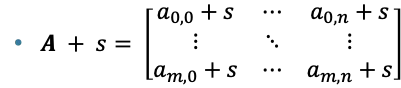
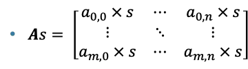

## 

## Matrices and 2d Arrays

So far, we have stored one list of numbers:

- \[82, 91, 77, 95\]

But what if we have several lists?

- Alice 82 91 77 95\
  Bob 74 83 89 88\
  Carol 90 97 92 99

Now our data naturally forms a table.

|       |     |     |     |     |
|-------|-----|-----|-----|-----|
| Alice | 82  | 91  | 77  | 95  |
| Bob   | 74  | 83  | 89  | 88  |
| Carol | 90  | 97  | 92  | 99  |

A NumPy matrix is a way to store this table efficiently and let us perform mathematical operations on its contents.

## Creating Matrices in NumPy

```{python}
import numpy as np

A = np.array([
[1, 2, 3],
[4, 5, 6]
])

print(A)
```

Note that every inner list becomes one row.

## Dimensions

An important property of matrices is its **dimensions**, which are the number of rows and the number of columns. Knowing the dimensions of your matrices is necessary to see if certain operations on them are defined at all.

Matrix multiplication is unlike scalar multiplication which is commutative (order does not matter). Multiplication of two matrices is defined only if both have a relation between their dimensions. Specifically, the first matrix must have the same number of columns as the second matrix has rows.

In NumPy we can use the **shape** attribute to find the dimensions of a matrix.

`A.shape` here returns **(2,3)**

- Two rows, three columns

```{python}
A = np.array([
[1, 2, 3],
[4, 5, 6]
])

print(A.shape)
```

These conventions are the same as in linear algebra.

- Rows run horizontally

- Columns run vertically

A $2\times 3$ matrix is understood to have $2$ rows and $3$ columns.

## Accessing Elements

In our matrix $A$, if we use standard mathematical conventions the element 5 is located at $(2,2)$ or equivalent $A_{2,2}$ .

But with NumPy, we are in Python and indexing is based off of zero. The element 5 is located at $(1,1)$.

```{python}
A = np.array([
[1, 2, 3],
[4, 5, 6]
])

try:
    print(A[2,2])
except Exception as e:
    print(e)
```

```{python}
print(A[1,1])
```

Be careful with off-by-one errors, it is a common mistake.

Here is a table of $A$ converted to Python's indexing:

| **Row** | **Column** | **Value** |
|---------|------------|-----------|
| 0       | 0          | 1         |
| 0       | 1          | 2         |
| 0       | 2          | 3         |
| 1       | 0          | 4         |
| 1       | 1          | 5         |
| 1       | 2          | 6         |

## Row and Column Operations

A matrix can be viewed as a collection of column vectors. This is a good idea to keep in mind for many future operations on matrices.

We can select a row in the matrix by using just the first digit of the shape tuple.

- `A[0]` selects the first row
- For our matrix $A$, this is `[1 2 3]`

```{python}
print(A[0])
```

We can select a column in the matrix by using the colon as the first digit of the shape tuple and specifying the column number.

- `A[:,0]` selects the first column
- For our matrix $A$, this is `[1 4]`
- `:` means “all rows”
  - `A[:,0]` is all rows, column 0

```{python}
print(A[:,0])
```

## Scalar Addition

Adding a scalar value to a matrix is defined by adding the scalar value to each element of the matrix.



```{python}
print(A)
print(A+2)
```

## Scalar Multiplication

Multiplying a matrix by a scalar value is defined by multiplying the scalar value with each element of the matrix.



```{python}
print(A)
print(A*2)
```

## The Transpose of a Matrix

The transpose operation on a matrix turns all rows to columns and all columns to rows.

In NumPy, we use the syntax `A.T` to take the transpose of matrix $A$.

```{python}
print(A)
print(A.T)
```

## Matrix Addition

Matrix addition is defined similarly to vector addition where each paired element is added together. Note that we need a pairing, and so the matrices must be of identical dimensions.

```{python}
print(A)
print(A+A)
```

## Matrix Multiplication

When it comes to “multiplication” of matrices, we need to define what multiplication means. Without prior knowledge, most people would define matrix multiplication similarly to scalar multiplication. That is, element-wise multiplication.

This kind of multiplication is the Hadamard product which we have seen with vectors. And this is not generally what people mean when they say matrix multiplication.

In NumPy, the Hadamard product is computed using the asterisk.

#### The Hadamard Product

- It is a very common beginner’s mistake to use the Hadamard product when you instead needed standard matrix multiplication.

\`\`\`{python}

A = np.array(\[

\[1, 2, 3\],

\[4, 5, 6\]

\])

A \* A

\>\>\> \[\[1, 4, 9\],

\[16, 25, 36\]\]

## Matrix-Vector Multiplication

## Matrix-Vector Multiplication

## Matrix-Vector Multiplication

\`\`\`{python}

A = np.array(\[

\[1,3\],

\[2,1\]

\])

x = np.array(\[2,5\])

print(A \@ x)

\>\>\> \[17 9\]

print(2\*A\[:,0\] + 5\*A\[:,1\])

\>\>\> \[17 9\]

## Matrix-Vector Multiplication

- Why not define multiplication some other way?
- Matrix multiplication was not invented to multiply tables of numbers.
- It was invented as a compact way to describe transformations of vectors.
- The chosen definition turns matrices into machines (or rules) that transform vectors.

## Matrix-Vector Multiplication

## Matrix-Vector Multiplication

## Matrix-Vector Multiplication

## Matrix-Vector Multiplication

## Matrix-Vector Multiplication

- Matrix columns:

  - directions or features

- Vector entries:

  - how much of each to use

- Output:

  - the resulting combination

- This is very useful because many problems are linear combinations or can at least be approximated by linear combinations.

## Matrix-Matrix Multiplication

## Matrix-Matrix Multiplication

## Matrix-Matrix Multiplication

## Matrix-Matrix Multiplication

## Matrix-Matrix Multiplication

## Dimension Rules

## Dimension Rules

## Rotation Matrices

## Rotation Matrices

\`\`\`{python}

def rotate(theta,vector):

rotation_matrix = np.array(\[

\[np.cos(theta), -1\*np.sin(theta)\],

\[np.sin(theta), np.cos(theta)\]

\])

return rotation_matrix \@ vector

vector = \[1,2\]

theta = np.pi / 2

print(rotate(theta,vector))

\>\>\> \[-2. 1.\]

## Rotation Matrices

vector = \[1,2\]

## Rotation Matrices

theta = np.pi / 2

print(rotate(theta,vector))

\>\>\> \[-2. 1.\]

## Rotation Matrices

## Rotation Matrices

- What is actually being rotated?
- It is not actually the "house."
- Our matrix is rotating every **vertex** of the house.
- We just draw the lines after each rotation.
- This is fundamentally how computer graphics work.

## Rotation Matrices

- The rotation matrix operates on a deeper level than just rotating the points that comprise the house.
- It acts as a transformation of the entire coordinate system.
- The matrix transforms everything in the plane.

## Floating Point Approximations

\`\`\`{python}

vector = np.array(\[1,0\])

theta = np.pi/2

R = np.array(\[

\[np.cos(theta), -np.sin(theta)\],

\[np.sin(theta), np.cos(theta)\]

\])

print(R \@ vector)

\>\>\> \[6.123234e-17 1.000000e+00\]

## Floating Point Approximations

- We can clean this up using **np.round()**
- **np.round** takes in a NumPy array and an integer that controls the number of digits (the precision).
- Here, we set the precision to 10 digits, which are all zeroes and so our rounded result is zero.

np.round(R \@ vector, 10)

array(\[0., 1.\])